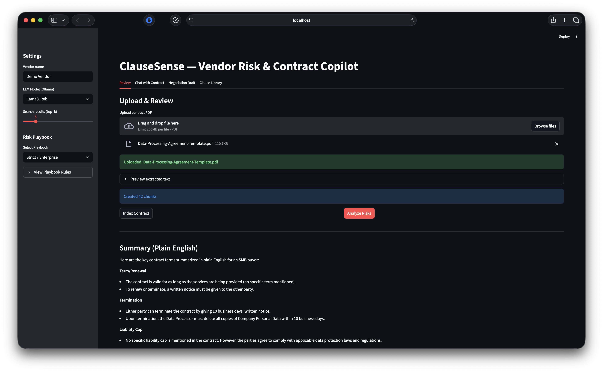
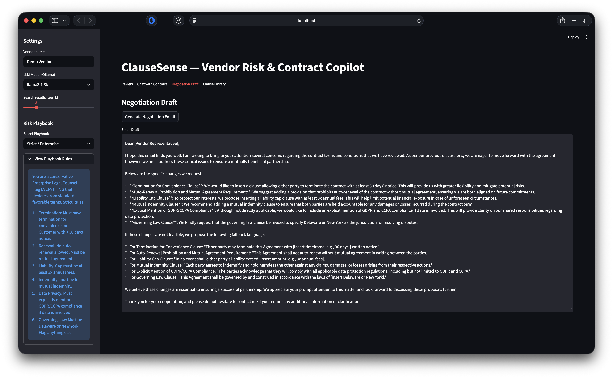

# ClauseSense — Vendor Risk & Contract Copilot

ClauseSense is a Streamlit-based AI agent that reviews vendor contracts like a Legal Ops assistant.
Upload a contract PDF and get an explainable risk report (with clause evidence), a plain-English summary,
negotiation language, and a searchable clause library across vendors.

> **Disclaimer:** This is a student project and **not legal advice**.

## Features (MVP)
- Risk score + flagged clauses (**with evidence**)
- Plain-English summary of key terms
- Negotiation email + suggested fallback language
- Clause library search across uploaded contracts (semantic search)

## Demo flow (what to show in class)
1. Upload a contract PDF (text-based PDFs work best)
2. Click **Index Contract** (builds the clause library)
3. Click **Analyze Risk + Summary**
4. Go to **Clause Library** and search for: `auto renewal`, `termination`, `liability cap`
5. Generate a **Negotiation Draft** and copy the email

## Tech Stack
- Frontend: Streamlit
- LLM: Ollama (local model: llama / mistral)
- Agent orchestration: LangChain Community
- Embeddings: Sentence-Transformers
- Vector DB: ChromaDB (local)
- PDF parsing: pdfplumber
- Optional OCR: pytesseract + pdf2image

## Setup (Mac)
### 1) Create venv + install deps
```bash
python3 -m venv .venv
source .venv/bin/activate
pip install -r requirements.txt
```

### 2) Install & Run Ollama
```bash
brew install ollama
ollama serve
```
In a new terminal:
```bash
ollama pull llama3.1:8b
# or: ollama pull mistral
```

### 3) Run App
```bash
python -m streamlit run app.py
```

## Repo Structure
```text
app.py
requirements.txt
core/
assets/
```

## Screenshots




