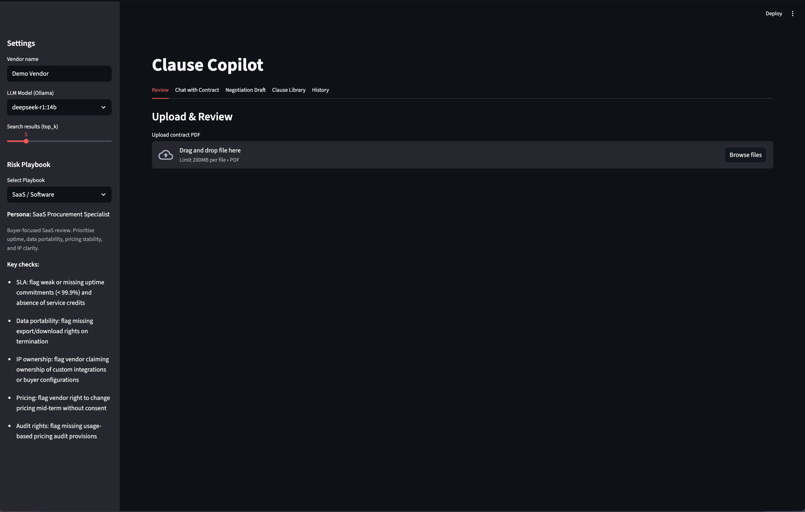

# Clause Copilot — Vendor Risk & Contract Copilot

A local-first, AI-powered contract review tool for small and mid-size businesses. Upload a vendor contract PDF, and Clause Copilot will identify risks, summarize key terms, draft a negotiation email, and let you search across all your past contracts — all running on your own machine with no data sent to the cloud.



---

## What It Does

Clause Copilot gives you four tools in one Streamlit interface:

**Review** — Upload a contract PDF. The app extracts text (with automatic OCR fallback for scanned documents), splits it into clause-level chunks, embeds them into a local vector store, and runs a structured risk analysis using a local LLM. Risks are ranked by severity (LOW / MED / HIGH / CRITICAL), each with a direct quote from the contract and a suggested fallback clause.

**Chat with Contract** — Ask plain-English questions about any uploaded contract. Answers are grounded in the actual contract text via retrieval-augmented generation (RAG), so the model won't invent clauses that aren't there.

**Negotiation Draft** — Automatically generates a professional negotiation email to the vendor based on the flagged risks, complete with specific change requests and proposed fallback language.

**Clause Library** — Semantic search across every contract you've ever indexed. Filter by vendor and search by concept (e.g. "auto-renewal", "termination for convenience") to find and compare specific clauses across your entire contract history.

---

## Architecture

```
┌─────────────────────────────────────────────────────┐
│                  Streamlit UI (app.py)               │
├──────────────┬──────────────┬───────────────────────┤
│  core/       │  core/       │  core/                │
│  ingest.py   │  chunking.py │  retrieval.py         │
│  (pdfplumber │  (section +  │  (8 risk-category     │
│  + OCR)      │  sentence    │  semantic queries)    │
│              │  aware)      │                       │
├──────────────┴──────────────┴───────────────────────┤
│  core/embeddings.py                                  │
│  (SentenceTransformers — all-MiniLM-L6-v2)          │
├──────────────────────────┬──────────────────────────┤
│  core/vectorstore.py     │  core/storage.py         │
│  (ChromaDB — persistent) │  (SQLite — outputs cache)│
├──────────────────────────┴──────────────────────────┤
│  core/agents.py                                      │
│  (Ollama — llama3.1, mistral, phi3, llama3)         │
│  Risk review · Summary · Negotiation · Chat          │
└─────────────────────────────────────────────────────┘
```

| Component | Technology |
|---|---|
| UI | Streamlit |
| LLM | Ollama (local) |
| Embeddings | `all-MiniLM-L6-v2` via SentenceTransformers |
| Vector store | ChromaDB (persistent on disk) |
| PDF extraction | pdfplumber + pytesseract (OCR fallback) |
| OCR system deps | Poppler + Tesseract |
| Persistence | SQLite |
| LLM retry logic | Tenacity |

---

## Prerequisites

- Python 3.10+
- [Ollama](https://ollama.com) installed and running locally
- At least one Ollama model pulled (see below)
- *(Optional, for scanned PDFs)* Poppler and Tesseract

---

## Setup

### 1. Clone the repo

```bash
git clone https://github.com/madhav-20/ClauseCopilot.git
cd ClauseCopilot
```

### 2. Create a virtual environment and install dependencies

```bash
python -m venv .venv
source .venv/bin/activate        # Windows: .venv\Scripts\activate
pip install -r requirements.txt
```

### 3. Install and start Ollama

Download Ollama from [ollama.com](https://ollama.com), then pull at least one model:

```bash
ollama pull llama3.1:8b    # recommended — best balance of quality and speed
# or
ollama pull mistral
ollama pull phi3:latest
```

Start the Ollama server (if it's not already running):

```bash
ollama serve
```

### 4. *(Optional)* Install OCR dependencies for scanned PDFs

**macOS:**
```bash
brew install poppler tesseract
```

**Ubuntu / Debian:**
```bash
sudo apt-get install -y poppler-utils tesseract-ocr
```

**Windows:** Install [Poppler for Windows](https://github.com/oschwartz10612/poppler-windows/releases) and [Tesseract](https://github.com/UB-Mannheim/tesseract/wiki), then add both to your PATH.

> If OCR dependencies are not installed, Clause Copilot will still work for text-based PDFs — it simply won't be able to process scanned/image-only contracts.

### 5. Run the app

```bash
streamlit run app.py
```

Open `http://localhost:8501` in your browser.

---

## Usage

### Reviewing a Contract

1. Enter a vendor name in the sidebar (used to tag your indexed clauses).
2. Select a **Risk Playbook** to set the review persona and rule set (see Playbooks section below).
3. Go to the **Review** tab and upload a contract PDF (up to 50 MB).
4. Click **Index Contract** to embed and store the clauses in ChromaDB.
5. Click **Analyze Risks** to run the full risk review and generate a summary.
6. Review flagged risks — each shows its severity, the evidence quote, why it's risky, and a suggested fallback clause.

### Chatting with a Contract

After indexing, switch to the **Chat with Contract** tab. Ask questions like:

- *"What is the liability cap?"*
- *"Does this contract auto-renew? What is the notice period?"*
- *"Who owns intellectual property created during the engagement?"*

The assistant answers strictly from the contract text and will tell you if it can't find the information.

### Generating a Negotiation Email

After running an analysis, go to the **Negotiation Draft** tab and click **Generate Negotiation Email**. The model will draft a professional email to the vendor requesting specific changes for each flagged risk, with proposed fallback language inline.

### Searching the Clause Library

Go to the **Clause Library** tab. Type any concept or phrase (e.g. *"data retention"*, *"indemnification"*, *"governing law"*) and the app will return semantically similar clauses across all indexed contracts. Optionally filter by vendor.

---

## Risk Playbooks

Playbooks let you control the reviewer's persona and the strictness of the analysis. Select one in the sidebar before running.

| Playbook | Persona | Use When |
|---|---|---|
| **Standard SMB** | Balanced Legal Ops Reviewer | General use — flags meaningful risks without over-lawyering |
| **Strict / Enterprise** | Conservative Enterprise Legal Counsel | High-value contracts — flags anything deviating from strong enterprise terms |
| **Light / Consultant** | Pragmatic Contract Consultant | Quick checks — only true deal-breakers flagged |

### Risk Categories Checked

The retrieval system targets these categories across all playbooks:

- Limitation of liability and liability caps
- Indemnity and indemnification
- Termination for convenience and auto-renewal
- Data privacy, security, and GDPR
- Payment terms, fees, and pricing
- Warranties and service level agreements (SLA)
- Confidentiality and non-disclosure
- Insurance and compliance

---

## Configuration

All paths and limits can be overridden via environment variables — useful if you want to point to a shared data directory or run multiple instances.

| Variable | Default | Description |
|---|---|---|
| `CLAUSE_DATA_DIR` | `data/` | Root directory for uploads, ChromaDB, and SQLite |
| `CLAUSE_MAX_UPLOAD_MB` | `50` | Maximum PDF upload size in megabytes |

The data directory layout is:

```
data/
├── uploads/      # uploaded PDF files
├── chroma/       # ChromaDB vector store (persistent)
└── app.db        # SQLite database (contracts + cached outputs)
```

---

## Project Structure

```
ClauseCopilot/
├── app.py                  # Streamlit app — all 4 tabs
├── requirements.txt
├── assets/
│   ├── demo1.png
│   └── demo2.png
└── core/
    ├── config.py           # Paths and env var config
    ├── ingest.py           # PDF extraction (pdfplumber + OCR)
    ├── chunking.py         # Section-aware clause chunking
    ├── embeddings.py       # SentenceTransformer embeddings
    ├── vectorstore.py      # ChromaDB upsert + semantic search
    ├── retrieval.py        # Risk-category retrieval queries
    ├── agents.py           # LLM prompts + Ollama API calls
    ├── playbooks.py        # Risk playbook definitions
    └── storage.py          # SQLite persistence layer
```

---

## Key Design Decisions

**Fully local by default.** No API keys required. No contract text leaves your machine. The LLM, embeddings, and vector store all run locally via Ollama and ChromaDB.

**Section-aware chunking.** The chunker uses regex to detect contract section headers (e.g. `1.2 Termination`, `LIMITATION OF LIABILITY`) and splits at sentence boundaries — so chunks map to actual clauses rather than arbitrary character windows.

**Multi-query retrieval for risk analysis.** Rather than sending the entire contract to the LLM, `retrieval.py` runs 8 targeted semantic queries (one per risk category) to surface only the most relevant clauses, then deduplicates and caps the evidence at ~14,000 characters to fit within Ollama's context window.

**Persistent analysis caching.** Risk reports, summaries, and negotiation emails are stored in SQLite and reloaded automatically the next time you upload the same contract — so you don't re-run expensive analysis unnecessarily.

**Retry logic on JSON parsing.** The risk review output is structured JSON. `agents.py` uses `tenacity` to retry up to 3 times if the model produces malformed JSON, with fallback parsing strategies (markdown fence stripping, trailing comma cleanup, etc.) before giving up.

---

## Supported Models

Any model available through Ollama works. These four are available by default in the sidebar:

| Model | Notes |
|---|---|
| `llama3.1:8b` | Recommended — strong legal reasoning, fast enough locally |
| `mistral` | Good alternative, slightly faster |
| `phi3:latest` | Lightest option, works on lower-spec machines |
| `llama3` | Older version of Llama 3 |

---

## In Progress

- [ ] Cloud LLM migration — replacing Ollama with an API-based model for zero-setup deployment
- [ ] Streamlit Cloud deployment for browser-based access without local setup
- [ ] Multi-contract comparison view — side-by-side clause diff across vendor agreements
- [ ] Export flagged risk report as PDF

---

## Requirements

```
streamlit>=1.28
pdfplumber>=0.10
sentence-transformers>=2.2
chromadb>=0.4
langchain-community>=0.0.20
pdf2image>=1.16
pytesseract>=0.3.10
tenacity>=8.2
```

---

## Disclaimer

Clause Copilot is a legal research and drafting aid, not a substitute for professional legal advice. Always have contracts reviewed by a qualified attorney before signing.

---

## Acknowledgements

Built as part of SCU MSIS coursework(GenAI for Enterprise).
Core development and architecture by Madhav Mundada.
Sara Malik contributed to prototyping and development.

---

## License

MIT
